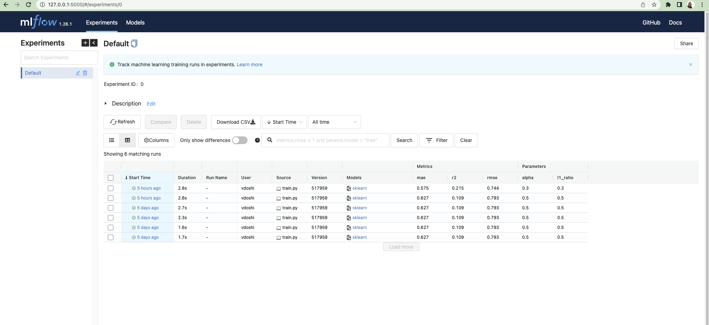

# ml-ai-cloudupskills

# About
this is a repo that aims to cover the fundamentals of Machine Learning and Artifical Intelligence.


### conda install on mac
wget https://repo.anaconda.com/miniconda/Miniconda3-latest-MacOSX-x86_64.sh -O ~/miniconda.sh
bash ~/miniconda.sh -b -p $HOME/miniconda


# Setup the conda virtual env
$ conda env create -f ./mlflow-tutorial/conda.yaml
$ conda activate tutorial
$ python mlflow-tutorial/train.py


Machine learning:
linear regression model
alpha
l1 ratio
prediction qualities

RMSE
MAE - mean absolute error
r2 - r squared

# Useful URLs:
https://www.run.ai/guides/machine-learning-operations/mlflow


http://archive.ics.uci.edu/ml/datasets/Wine+Quality


https://www.youtube.com/watch?v=R15LjD8aCzc

# Data- csv file
```bash
"fixed acidity";"volatile acidity";"citric acid";"residual sugar";"chlorides";"free sulfur dioxide";"total sulfur dioxide";"density";"pH";"sulphates";"alcohol";"quality"
7.4;0.7;0;1.9;0.076;11;34;0.9978;3.51;0.56;9.4;5
7.8;0.88;0;2.6;0.098;25;67;0.9968;3.2;0.68;9.8;5
7.8;0.76;0.04;2.3;0.092;15;54;0.997;3.26;0.65;9.8;5
11.2;0.28;0.56;1.9;0.075;17;60;0.998;3.16;0.58;9.8;6
7.4;0.7;0;1.9;0.076;11;34;0.9978;3.51;0.56;9.4;5
```


```bash
y = a_0 + a_1 * x      ## Linear Equation
```

# Run the ui
```bash
mlflow ui
```


Serve a model:
```bash
mlflow models serve -m ./mlruns/0/061fdef06e044aa19f4d0ab9baec8995/artifacts/model/ -p 1234
```

Try out a model using inputs:
```bash
curl -X POST -H "Content-Type:application/json; format=pandas-split" --data '{"columns":["alcohol", "chlorides", "citric acid", "density", "fixed acidity", "free sulfur dioxide", "pH", "residual sugar", "sulphates", "total sulfur dioxide", "volatile acidity"],"data":[[12.8, 0.029, 0.48, 0.98, 6.2, 29, 3.33, 1.2, 0.39, 75, 0.66]]}' http://127.0.0.1:1234/invocations

This is what is returned: [5.120775719594933]%     
```

